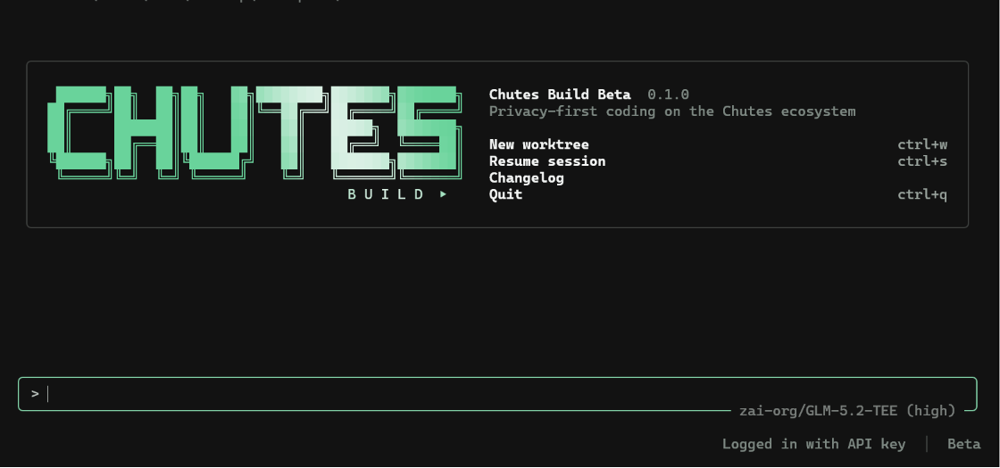

# Chutes Build

**A privacy-first, open-source coding agent built for the [Chutes](https://chutes.ai) ecosystem.**

[](https://github.com/TheStreamCode/chutes-build/actions/workflows/ci.yml)
[](https://www.npmjs.com/package/chutes-build)
[](LICENSE)


One CLI, no compromises: an interactive terminal UI, a full coding agent
runtime, native Chutes model routing, parallel subagents, multimodal
generation, web research, browser automation, and local memory — with
telemetry, remote trace upload, and phone-home update checks disabled.



> **Development preview:** the project is under active development. Build it
> from source and review agent actions before approving changes.

## Contents

- [Highlights](#highlights)
- [Quick start](#quick-start)
- [Features](#features)
- [Configuration](#configuration)
- [CLI reference](#cli-reference)
- [Privacy & security](#privacy--security)
- [Project](#project)

## Highlights

- 🔒 **Privacy by construction** — telemetry, remote error reporting, automatic
  update checks, remote trace upload, and upstream session sharing are all
  disabled at the product-policy level.
- ⚡ **Chutes-native inference** — live model discovery, `Auto (Chutes Router)`
  as the default, and automatic fallback when a model is temporarily
  unavailable.
- 🧭 **Advisor** — an on-demand reasoning agent that reviews plans, blockers,
  and completion claims without ever taking over the executor loop.
- 🧩 **Subagent orchestration** — concurrent fan-out with isolated worktrees
  for real parallel decomposition, not just sequential delegation.
- 🎨 **Multimodal, natively** — image, video, music, speech, and on-demand OCR,
  built directly into the Rust runtime instead of a bolted-on MCP process.
- 🧠 **Hybrid memory & voice** — full-text plus semantic vector recall, and
  hold-to-record voice dictation, both on by default.

See [Features](#features) below for the complete list.

## Quick start

### Install with npm

Release builds install without a Rust toolchain:

```powershell
npm install -g chutes-build
chutes-build
```

For one-off use:

```powershell
npx chutes-build
```

The npm launcher selects a native binary for Windows, macOS, or Linux. It does
not collect telemetry and does not download executables from an install script.

### Build from source

Prerequisites:

- Rust stable (`rustup` is recommended)
- Git
- a platform C/C++ build toolchain supported by Rust

Protocol Buffer tooling is vendored for normal builds; a separate `protoc`
installation is not required.

```powershell
git clone https://github.com/TheStreamCode/chutes-build.git
cd chutes-build
cargo build -p chutes-build --release
```

The Windows executable is `target\release\chutes-build.exe`; on macOS and
Linux it is `target/release/chutes-build`.

### First run

Run `chutes-build` with no prior setup and log in from the welcome screen:
press `l` for "Login with Chutes" (opens your browser) or `k` to paste a
Chutes API key directly. `/login` reopens this choice at any time and
`/apikey` jumps straight to the API-key prompt.

To provide a key non-interactively instead, create one in Chutes and either
expose it only to the current process:

```powershell
$env:CHUTES_API_KEY = "your-api-key"
chutes-build
```

or store it using the hidden-input login flow:

```powershell
chutes-build login
chutes-build
```

`Auto (Chutes Router)` is the first entry in the model picker and the default
when no preference has been saved. Select a concrete model with `/model` or
`chutes-build --model <model-id>`. Inspect the resolved catalog with
`chutes-build models` or machine-readable `chutes-build models --json`.

## Features

### Agent & coding

- **Coding agent runtime:** repository inspection, edits, shell commands,
  planning, goals, MCP servers, skills, sessions, worktrees, and permission
  controls inherited from the mature upstream runtime.
- **Local session lifecycle:** list, search, resume, fork, export, trace, and
  delete sessions without a remote registry. Machine-readable list/search
  output is available with `--json`; destructive commands require confirmation
  unless `--yes` is supplied.
- **Advisor:** a read-only, on-demand reasoning agent that reviews plans,
  difficult decisions, blockers, and completion claims without taking over the
  executor loop. Reasons at maximum effort by default. `/advisor on|off`
  toggles it; `/advisor <model>` pins a specific model (e.g. your largest or
  highest-tier available one — Chutes' catalog carries no price/size metadata
  to pick one automatically); `/advisor default` clears the pin.
- **Subagent orchestration:** foreground and background workers, concurrent
  fan-out, multi-worker waits, bounded nesting, and isolated worktrees. The
  `chutes-build-orchestrator` preset is tuned for parallel decomposition.

### Chutes integration

- **Chutes-native inference:** API-key authentication, live model discovery,
  `Auto (Chutes Router)` as the first model choice, configurable fallback
  chains, and automatic retry when a selected model is temporarily unavailable.
- **Chutes account:** read-only subscription, quota, and usage access through
  `get_chutes_usage`, a compact plan/quota indicator in the TUI, and detailed
  `/usage` output. Per-model statistics remain disabled unless requested.
- **Chutes media:** live discovery and invocation for image generation and
  editing, video, music, speech, and other supported Chutes media models through
  `list_media_models`, `describe_media_model`, and `generate_media`. This is the
  native Rust integration of the `chutes-media-mcp` workflow, so Chutes Build
  does not need to spawn a separate Node/MCP process for its core media tools.
  Generated output crosses the tool/ACP/TUI boundary as a typed artifact:
  images use bounded lazy previews, videos use a two-frame rolling decoder,
  and music/speech expose local pause/resume, seek, volume, duration, and
  waveform controls with native-player fallback. Media work starts only while
  inference is idle, never autoplays, and stays off the TUI render thread.
- **Capability routing:** image inputs stay with the selected model when it
  supports vision and are otherwise delegated to a vision-capable Chutes route.
- **On-demand OCR:** the `ocr_page` tool extracts text verbatim from a single
  image or PDF page via a dedicated Chutes vision model, independent of the
  active chat model's vision support. Returns extracted text only — the image
  itself is never added to the conversation.

### Research & tools

- **Current coding documentation:** Context7 search and documentation tools are
  built in and avoid sending credentials or known secrets.
- **Official Chutes research:** before answering Chutes-specific questions, the
  main agent and subagents consult both the official
  [documentation](https://chutes.ai/docs) and [news](https://chutes.ai/news),
  treating directly relevant official pages as primary authority.
- **Research and browser tools:** native web search (DuckDuckGo by default,
  optionally Brave) plus agentic Chrome/Edge control through a local DevTools
  connection and an isolated temporary browser profile. Browser actions accept
  either CSS selectors or the numeric element indices shown by snapshots.

### Memory & voice

- **Local memory:** Chutes Build maintains a secret-filtered `memories.md` file
  and can be launched with `--no-memory` when a stateless session is preferred.
  Recall is hybrid by default — full-text search combined with semantic vector
  search against a built-in Chutes-hosted embedding model. Semantic recall
  sends the selected memory chunks to that Chutes embedding endpoint; use
  `--no-memory` when this is not appropriate.
- **Voice input:** hold-to-record dictation transcribes speech into the prompt
  box. Enabled by default; activation is always manual (mic icon, `/voice`, or
  Ctrl+Space) — Chutes Build never records without an explicit press.
- **Time awareness and wellness:** the agent receives the local date, time, and
  timezone and can suggest a break after long or late sessions.

### Privacy by construction

Telemetry, remote error reporting, automatic update checks, remote trace
upload, upstream session sharing, and remote workspace exposure are disabled.
Updates are installed manually from npm or a release artifact. See
[Privacy & security](#privacy--security) below for the full data boundary.

## Configuration

### State root

User state defaults to `~/.chutes-build`. Set `CHUTES_BUILD_HOME` to relocate
the complete state tree, including configuration, credentials, sessions, logs,
trace exports, plugins, user roles/personas, and the managed bundled-agent
cache. Chutes Build does not combine roles or bundle data from the default home
with a custom state root.

Project-scoped `.chutes-build` directories remain inside their repositories and
continue to take precedence over user and bundled agent definitions.

### Model selection, reasoning, and routing

Auto sends `model-router` requests to the Chutes router endpoint, allowing the
service to select a model for the task and handle cold or unavailable capacity.
A concrete model remains pinned unless a qualifying pre-stream failure advances
the explicit fallback chain.

Reasoning is model-specific. The model picker exposes only the controls
supported by the exact deployed generation: binary `Instant`/`Thinking` modes,
GLM-5.2's three modes, or no selector for fixed and non-reasoning models. Use
`/effort` interactively or `--effort <option-id>` in headless invocations. The
published model default is preserved unless the user explicitly changes it.

See [Model reasoning compatibility](docs/model-reasoning-compatibility.md) for
the current model matrix and forward-compatibility rules.

```powershell
# Ordered comma-separated fallback chain. model-router is appended as the
# final Chutes fallback unless strict mode is enabled.
$env:CHUTES_FALLBACK_MODELS = "model-a,model-b"

# Never change the selected model automatically.
$env:CHUTES_STRICT_MODEL = "1"
```

Fallback happens only for transient availability/capability responses and only
before response streaming begins. Chutes Build does not redirect requests or
credentials to a non-Chutes inference endpoint.

Ambient Chutes credentials are attached only to official Chutes/router
endpoints. Custom inference models must declare their own `api_key` or
`env_key`; a custom model-catalog endpoint uses the dedicated
`CHUTES_MODELS_API_KEY`. Neither receives `CHUTES_API_KEY` or a cached Chutes
session token implicitly.

The inference client shares pooled HTTP connections, enables TCP no-delay, and
forwards parsed SSE events without an application-level streaming buffer. Cold
starts and model-side generation can still dominate latency. Auto is the
recommended default when a particular model is not required. The client does
not apply reduced-quality generation settings; target selection and quality
remain router decisions.
Selecting `Instant` can reduce reasoning latency, but it intentionally changes
the model's reasoning behavior and is never enabled silently.

### Account plan and quota

When authenticated, Chutes Build fetches subscription usage, plan metadata, and
quota data concurrently. The TUI status bar shows the plan plus the rolling
four-hour and monthly percentages when available; its color follows the most
constrained active window and changes at 80% and 100%. Click the indicator or
run `/usage` for every active window, percentage, and reset time. If aggregate
quota usage is unavailable, the client falls back concurrently to the
documented per-chute quota endpoints.

### OAuth login (Sign in with Chutes)

Pressing `l` at the welcome screen (or `/login`) runs a standard OAuth 2.0 +
PKCE flow against Chutes' own identity provider. The built-in app is a public
client and does not bundle or require a client secret. Custom confidential
clients can be configured under
[Chutes' developer settings](https://chutes.ai/app/api):

```powershell
$env:CHUTES_BUILD_OAUTH2_CLIENT_ID = "cid_..."
$env:CHUTES_BUILD_OAUTH2_CLIENT_SECRET = "csc_..."   # only if your app has one
chutes-build
```

Both variables are read from the environment and are never written to
`config.toml` or any other file on disk. The custom secret is included in both
the initial token exchange and refresh requests. `k` / `/apikey` (pasting a
Chutes API key directly) needs no app registration.

### Optional web and browser configuration

Web search uses DuckDuckGo without a dedicated key. For Brave Search:

```powershell
$env:BRAVE_SEARCH_API_KEY = "your-brave-key"
$env:CHUTES_WEB_SEARCH_PROVIDER = "brave"
```

Browser automation discovers Chrome or Edge automatically. Overrides:

```powershell
$env:CHUTES_BROWSER_EXECUTABLE = "C:\Program Files\Google\Chrome\Application\chrome.exe"
$env:CHUTES_BROWSER_HEADFUL = "1" # optional; default is headless
```

Browser screenshots may only be written inside the active workspace. The
automation profile is temporary, isolated from the user's normal browser
profile, and launched with sync and background-update features disabled.

Video attachments are sampled locally with FFmpeg and routed as representative
frames through the same Chutes vision path. Set `CHUTES_FFMPEG_EXECUTABLE` when
FFmpeg is not discoverable on `PATH`; restart Chutes Build after installing or
changing FFmpeg so the per-process capability cache is refreshed.

Media behavior can be tuned with the compatible `chutes-media-mcp` variables
`CHUTES_OUTPUT_DIR`, `CHUTES_WARMUP`, `CHUTES_COLD_START_RETRIES`,
`CHUTES_ALLOW_UNKNOWN_PARAMS`, and `CHUTES_PROVENANCE`. Downloaded media is
limited to 512 MiB by default (`CHUTES_MAX_MEDIA_BYTES`, hard ceiling 2 GiB),
while workspace inputs are limited to 64 MiB by default
(`CHUTES_MAX_INPUT_ASSET_BYTES`, hard ceiling 512 MiB).

## CLI reference

The complete command and option reference is in
[docs/cli-reference.md](docs/cli-reference.md). Interactive slash commands are
documented in [docs/slash-commands.md](docs/slash-commands.md). Installed
binaries remain authoritative for the exact version: use
`chutes-build --help` and `chutes-build <command> --help`.

## Privacy & security

### Local data

User-level state defaults to `~/.chutes-build` or the directory set in
`CHUTES_BUILD_HOME`. Project memory is stored in `memories.md`. Configuration,
sessions, logs, exports, credentials, plugins, user roles/personas, and bundled
agent definitions remain local. Prompts, selected repository content, memory
embeddings, voice recordings, OCR/media inputs, and browser traffic leave the
machine only when their corresponding hosted feature is invoked.

See [PRIVACY.md](PRIVACY.md) for the exact network and data boundaries.

### Security model

Chutes Build is an agent capable of reading files, running commands, editing
code, and controlling an isolated browser. Use it only in repositories you
trust, review proposed commands, and keep the default permission checks enabled
for sensitive work. Never place API keys in prompts, source files, or committed
configuration. See the [security review](docs/security-review.md) for release
controls, trust boundaries, and tracked dependency exceptions.

## Project

### Provenance

Chutes Build is a substantially modified fork of
[`xai-org/grok-build`](https://github.com/xai-org/grok-build). The upstream
project is licensed under Apache License 2.0; this fork retains the upstream
license and third-party notices.

See [NOTICE](NOTICE), [LICENSE](LICENSE), and
[THIRD-PARTY-NOTICES](THIRD-PARTY-NOTICES) for attribution.

New upstream releases and commits are detected by a read-only scheduled check
and reviewed through the documented [upstream synchronization
procedure](docs/upstream-sync.md); upstream changes are never merged or released
automatically.

### Contributing

Issues and focused pull requests are welcome. Read
[CONTRIBUTING.md](CONTRIBUTING.md), [SECURITY.md](SECURITY.md), and
[CODE_OF_CONDUCT.md](CODE_OF_CONDUCT.md) before contributing.

Copyright 2026 Michael Gasperini (Mikesoft).
