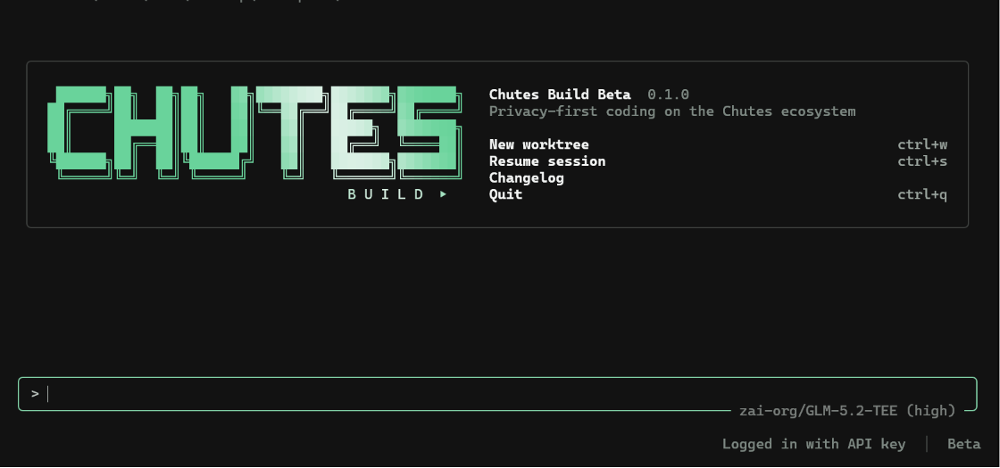

# Chutes Build

**A privacy-first, open-source coding agent built for the
[Chutes](https://chutes.ai) ecosystem.**

[](https://github.com/TheStreamCode/chutes-build/actions/workflows/ci.yml)
[](https://www.npmjs.com/package/chutes-build)
[](LICENSE)

Chutes Build combines a polished terminal interface, a production-grade agent
runtime, Chutes-native model routing, subagents, local memory, multimodal tools,
web research, and browser automation. Telemetry, remote trace upload, upstream
session sharing, and phone-home updates are disabled by product policy.



> **Development preview:** Chutes Build is under active development. Review
> commands and file changes before approving them, especially in unfamiliar
> repositories.

## Why Chutes Build

| Principle | What it means |
| --- | --- |
| **Chutes-native** | Live model discovery, `Auto (Chutes Router)`, model-aware reasoning controls, account usage, OCR, voice, and media generation are integrated directly into the Rust runtime. |
| **Private by default** | Sessions, memory, traces, logs, configuration, and exports stay local. Cloud features run only when their documented provider call is needed. |
| **Built for real repositories** | Planning, permission controls, worktrees, MCP, skills, background tasks, advisor review, and parallel subagents share one coherent session model. |
| **Transparent fork** | Chutes-specific product code is separated from retained `grok-build` infrastructure, with documented upstream review and Apache-2.0 attribution. |

## Quick start

### Install

The npm package selects the native binary for Windows, macOS, or Linux. A Rust
toolchain is not required.

```powershell
npm install -g chutes-build
chutes-build
```

For one-off use:

```powershell
npx chutes-build
```

The launcher does not download executables from a lifecycle script.

### Authenticate

An API key is the most reliable way to start. Create one in the Chutes
dashboard, then press `k` on the welcome screen, run `/apikey`, or store it
through the hidden-input CLI flow:

```powershell
chutes-build login
chutes-build
```

For a process-local credential:

```powershell
$env:CHUTES_API_KEY = "your-api-key"
chutes-build
```

Browser-based OAuth with PKCE is available through `l` or `/login`. Chutes
OAuth applications may require registered client credentials; see
[Authentication](docs/getting-started.md#authentication) for the supported
fallbacks and environment variables.

### Choose a model

`Auto (Chutes Router)` is the default when no model preference has been saved.
Use `/model` interactively or inspect the live catalog from the CLI:

```powershell
chutes-build models
chutes-build models --json
chutes-build --model model-router
```

## What is included

| Area | Capabilities |
| --- | --- |
| **Agent runtime** | Repository inspection, edits, shell commands, plans, goals, permissions, sandbox profiles, local sessions, worktrees, and structured headless output. |
| **Model routing** | Live Chutes catalog, automatic routing, explicit fallback chains, exact-generation reasoning controls, and vision-capability delegation. |
| **Orchestration** | Read-only advisor, foreground/background subagents, concurrent fan-out, bounded nesting, grouped waits, and isolated worktrees. |
| **Knowledge** | Context7 library documentation, official Chutes source checks, web search, local full-text memory, and Chutes-hosted semantic recall. |
| **Multimodal** | Image and PDF OCR, image/video understanding, voice dictation, and typed image, video, music, and speech generation artifacts. |
| **Automation** | MCP servers, plugins, skills, background tasks, and isolated Chrome/Edge control through local DevTools. |

Generated media is streamed to bounded temporary storage and persisted with
create-new semantics. Inline previews remain local; unsupported terminals use
safe text cards and native-player fallbacks.

## Privacy contract

| Boundary | Policy |
| --- | --- |
| **Local state** | Configuration, credentials, sessions, memory, logs, traces, exports, plugins, and agent definitions live under `~/.chutes-build` or `CHUTES_BUILD_HOME`. |
| **Hosted inference** | Prompts and selected context leave the machine only for the Chutes model request that needs them. Semantic memory sends selected memory chunks to the configured Chutes embedding route. |
| **Explicit tools** | OCR, voice, media, web, browser, MCP, and plugin actions send only the inputs required by the selected operation and provider. |
| **Disabled surfaces** | Product telemetry, remote error reporting, automatic trace upload, upstream session sharing/search, remote workspace exposure, and automatic updates cannot be enabled through normal configuration. |
| **Credentials** | Ambient Chutes credentials are restricted to allowlisted official HTTPS hosts. Custom endpoints require dedicated credentials and explicit trust configuration. |

Read [Privacy](PRIVACY.md) for the complete data-flow inventory and
[Security](SECURITY.md) for the threat boundaries and reporting process.

## Common workflows

Start an interactive session in the current repository:

```powershell
chutes-build
```

Run one headless task:

```powershell
chutes-build -p "Review this repository and report only actionable findings"
```

Create an isolated worktree session:

```powershell
chutes-build --worktree feature-auth
```

Resume the latest session for the current directory:

```powershell
chutes-build --continue
```

Use `chutes-build --help` for the installed version's authoritative option
set. See the [CLI reference](docs/cli-reference.md) and
[slash-command reference](docs/slash-commands.md) for the maintained overview.

## Documentation

- [Getting started](docs/getting-started.md) — installation, authentication,
  first session, models, and troubleshooting.
- [Configuration](docs/configuration.md) — state paths, routing, credentials,
  web/browser options, media limits, and development-only endpoint overrides.
- [CLI reference](docs/cli-reference.md) and
  [slash commands](docs/slash-commands.md) — public command surfaces.
- [Architecture](docs/ARCHITECTURE.md) — runtime layers and ownership map.
- [Privacy](PRIVACY.md), [security policy](SECURITY.md), and
  [security review](docs/security-review.md) — operational trust boundaries.
- [Documentation index](docs/README.md) — complete user, maintainer, and design
  reference map.

The concise guides available through `/docs` are embedded from
`crates/codegen/xai-grok-pager/docs/user-guide/`.

## Build from source

Prerequisites are Rust stable, Git, and the native C/C++ toolchain required by
Rust on your platform. Protocol Buffer tooling is vendored for normal builds.

```powershell
git clone https://github.com/TheStreamCode/chutes-build.git
cd chutes-build
cargo build -p chutes-build --release
```

The executable is `target\release\chutes-build.exe` on Windows and
`target/release/chutes-build` on macOS/Linux.

### Repository map

| Path | Ownership |
| --- | --- |
| `crates/chutes-build-core/` | Chutes routing, endpoint policy, catalog, reasoning, account, media, privacy, and product policy. |
| `crates/codegen/` | Retained and adapted upstream runtime crates. Keep crate names stable to make upstream review practical. |
| `npm/` | Native launcher, platform-package assembly, and npm verification. |
| `docs/` | Public technical references, maintainer procedures, and design records. |
| `.github/workflows/` | CI, dependency review, upstream monitoring, and release packaging. |
| `prod/` and `third_party/` | Shared protocol sources and retained attribution/material from upstream. |

The root `Cargo.toml` is generated and treated as read-only. Make dependency
changes in the owning crate manifest or generator source instead of manually
reorganizing the generated workspace.

## Project

Chutes Build is a substantially modified fork of
[`xai-org/grok-build`](https://github.com/xai-org/grok-build). Upstream changes
are reviewed and ported selectively; they are never merged or released
automatically. See [Upstream synchronization](docs/upstream-sync.md).

Issues and focused pull requests are welcome. Read
[CONTRIBUTING.md](CONTRIBUTING.md), [CODE_OF_CONDUCT.md](CODE_OF_CONDUCT.md),
and [SECURITY.md](SECURITY.md) before contributing.

Apache-2.0 licensing and attribution are documented in [LICENSE](LICENSE),
[NOTICE](NOTICE), and [THIRD-PARTY-NOTICES](THIRD-PARTY-NOTICES).

Copyright 2026 Michael Gasperini (Mikesoft).
